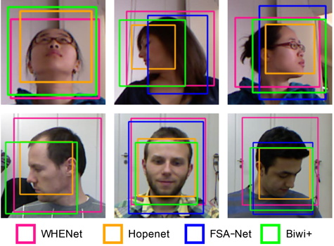

https://user-images.githubusercontent.com/35331054/216019397-2aa3de5f-ea02-4f64-898f-7f787a65cd35.mp4
###### Our head pose predictions on Biwi [[8]](#8) dataset

# Updates
- **29.03.2023**
  Added a webcam demo ([[here]](demo/readme.md))
- **20.03.2023**
  Fixed a bug for 6DRepNet evaluation. 6DRepNet was trained with BGR images, but I used RGB for the evaluation. With this update BGR images are used instead, and the performance is now similar to the paper.

# HeadPose+

Are head pose estimation results comparable? `not really`  
We provide a comprehensive analysis of factors associated with the evaluation of head pose estimation methods.
We focus on the popular Biwi Kinect Head Pose Database (Biwi) [[8]](#8) and show that different processing leads to incomparable test sets (Biwi variants).

What can you find:

- Comprehensive [evaluation](#compilation-of-results) of head pose estimation methods on Biwi variants
- Models, checkpoints and test code for our works
    - RCRw [[1]](#1)[[2]](#2) 
    - PADACO [[3]](#3)
- Code to reproduce and evaluate on different Biwi variants for
    - Hopenet [[4]](#4)
    - FSA-Net [[5]](#5)
    - 6DRepNet [[6]](#6)
    - WHENet [[7]](#7)
- Biwi+, [file](data/Biwi_plus.npz) [[3]](#3)
    - Manually checked face bounding boxes for **all frames** of Biwi [[8]](#8)
    - Pose labels in RGB camera frame and z-y'-x'' rotation sequence
- Face bounding boxes and test sets (subsets) for Biwi [[8]](#8) used by other authors, we call these "Biwi variants"
    - MTCNN [[9]](#9) (FSA-Net)
    - Dockerface [[10]](#10) (Hopenet) 
    - YOLOv3 [[11]](#11) (WHENet)
- A PyTorch Biwi variant dataset, [file](hpp/BiwiDataset.py), to easily load the Biwi variants


  
###### Biwi variants: Image of different face bounding boxes used by different methods for cropping Biwi [[8]](#8).

## Takeaways:
- Do different face detectors result in different **test sets**?  
  `Yes` quite drastic differences as the face detector determines a subset of the original Biwi files to be used as test set  
  (e.g., over 15% of Biwi images skipped for FSA-Net variant)

- Do different test sets change head pose estimation performance?  
  `Yes` performance differences sometimes seem bigger than method related gains

- Is it important to use the same face detector for training and testing?  
  `No/depends` we can achieve similar performance if we post process the detections of different face detection algorithms to have similar bounding boxes (produce a similar face crop) as the ones used during training (requires a known mapping)  
  Sometimes similar performance can be achieved with boxes from a detector not used during training (depends on method)  
  However, we notice that even changing the box size by one pixel can result in different results
  
- Does it matter in which rotation representation (Euler angle rotation order), e.g., z-y'-x'' (we call pyr) or x-y'-z'' (we call ypr), we evaluate our methods?  
  `Yes` the results can be quite different and are not comparable
  
- Does correcting the pose from depth camera to RGB camera for Biwi improve results? ([why do we need this?](#biwi-calibration))  
  `No`, **no** calibration seems to be better.  
  A possible explanation could be a global offset of center pose (0,0,0) between datasets. (let us know if you find an explanation)
  
- Is SOTA performance for Biwi on current paperswithcode leaderboard meaningful?  
  `Not really`, e.g., Hopenet (2018), reported MAE 4.89 but achieves MAE 3.82 on the Biwi variant used by FSA-Net (2019)
  
Therefore, we suggest evaluation and comparison of results with precisely defined evaluation protocols and to report them.
Biwi+ is a step in this direction. It provides a fixed test set with face bounding boxes for all Biwi images.

## Compilation of Results

All results can be found [[here]](results/readme.md).
This section is just a compilation of results on Biwi processed like Biwi+ [[3]](#3) and Biwi processed like FSA-Net [[3]](#3), except we generously selected the best performing face crop for each method. Some methods have better results than reported in their publications.

### Results on Biwi FSA-Net variant (Biwi test set used by FSA-Net evaluation and others)

|  Method | MAE | Pitch | Yaw | Roll | Format | Test Set | Num Images | Training Set | Crop | Unsup. Training on Test Set | Calibrated Biwi |
| :--- | :--- | :--- | :--- | :--- | :--- | :--- | :--- | :--- | :--- | :--- | :--- |
|  WHENet 2020| 4.79 | 5.06 | 6.00 | 3.33 | ypr | Biwi (FSA-Net) | 13219 | 300W_LP | Biwi+ (DLIB+manual) | ✖ | ✖ |
|  FSA-Net 2019| 3.91 | 4.78 | 4.29 | 2.66 | ypr | Biwi (FSA-Net) | 13219 | 300W_LP | Biwi+ (DLIB+manual) | ✖ | ✖ |
|  Hopenet 2018| 3.82 | 4.75 | 3.98 | 2.73 | ypr | Biwi (FSA-Net) | 13219 | 300W_LP | Biwi+ -> Dockerface, Hopenet | ✖ | ✖ |
|  [RCRw (proposed)](#1) 2023 | 3.63 | 4.51 | 3.78 | **2.60** | ypr | Biwi (FSA-Net) | 13219 | 300W-LP | Biwi+ (DLIB+manual) | ✔ | ✖ |
|  **6DRepNet 2022**|  **3.41** |  **3.92** |  **3.70** |  **2.60** | ypr | Biwi (FSA-Net) |  13219 | 300W-LP | Biwi+ -> MTCNN, FSA-Net | ✖ | ✖ |
| | | | | | | | | | | | |
|  [PADACO](#3) 2019 | 3.69 | 4.20 | **3.31** | 3.56 | ypr | Biwi (FSA-Net) | 13219 | SynHead++ | Biwi+ (DLIB+manual) | ✔ | ✖ |
|  **[RCRw (proposed)](#1)** 2023 | **3.34** | **3.91** | 3.43 | **2.68** | ypr | Biwi (FSA-Net) | 13219 | SynHead++ | Biwi+ (DLIB+manual) | ✔ | ✖ |

### Results on Biwi+ 

Except Hopenet all methods perform best using Biwi+ face bounding boxes.

|  Method | MAE | Pitch | Yaw | Roll | Format | Test Set | Num Images | Training Set | Crop | Unsup. Training on Test Set | Calibrated Biwi |
| :--- | :--- | :--- | :--- | :--- | :--- | :--- | :--- | :--- | :--- | :--- | :--- |
|  WHENet | 7.25 | 8.00 | 8.05 | 5.72 | pyr | Biwi+ | 15678 | 300W_LP | Biwi+ (DLIB+manual) | ✖ | ✔ |
|  FSA-Net | 5.75 | 6.43 | 6.27 | 4.55 | pyr | Biwi+ | 15678 | 300W_LP | Biwi+ (DLIB+manual) | ✖ | ✔ |
|  Hopenet | 5.73 | 7.65 | 5.32 | 4.21 | pyr | Biwi+ | 15678 | 300W_LP | Biwi+ -> Dockerface, Hopenet | ✖ | ✔ |
|  [RCRw (proposed)](#1) | 4.55 | 6.34 | **4.55** | **2.74** | pyr | Biwi+ | 15678 | 300W-LP | Biwi+ (DLIB+manual) | ✔ | ✔ |
|  **6DRepNet** |  **4.39** |  **5.19** |  4.62 |  3.37 | pyr | Biwi+ |  15678 | 300W-LP | Biwi+ (DLIB+manual) | ✖ | ✔ |
| | | | | | | | | | | | |
|  [PADACO](#3) | 4.13 | **4.51** | 4.11 | 3.78 | pyr | Biwi+ | 15678 | SynHead++ | Biwi+ (DLIB+manual) | ✔ | ✔ |
|  **[RCRw (proposed)](#1)** | **3.86** | 4.73 | **3.95** | **2.89** | pyr | Biwi+ | 15678 | SynHead++ | Biwi+ (DLIB+manual) | ✔ | ✔ |


## How To

### Setup

```sh
git clone --recurse-submodules https://github.com/kuhnkeF/headposeplus.git HeadPosePlus
cd HeadPosePlus
```

0. We assume a working Anaconda distribution. We use Anacondas virtual environment manager.

1. Change "path_biwi" in (hpp/BiwiDataset.py) to point to your copy of Biwi
  - download Biwi Kinect Head Pose Database [official website](https://data.vision.ee.ethz.ch/cvl/gfanelli/head_pose/head_forest.html#db)
  - change "path_biwi" in (hpp/BiwiDataset.py) to your path containing the folders 01,02,03,...  
2. Download the model/checkpoint files, [see here](models/readme.md)

```sh
chmod +x create_pytorch_env.sh
chmod +x create_tensorflow_env.sh
chmod +x eval_all.sh
./create_pytorch_env.sh
./create_tensorflow_env.sh
./eval_all.sh
```
### Virtual Environments

To run the code we decided to use two environments:

  - A PyTorch environment for evaluation of PADACO, RCRw, Hopenet, 6DRepNet
    
  - A Tensorflow environment with Keras to evaluate FSA-Net and WHENet

The following scripts set up the environments and install the dependencies.

```sh
create_pytorch_env.sh
create_tensorflow_env.sh
```

### Run Code
Run this script (or check out the eval_* python files) to compute the results. 
```sh
eval_all.sh
```
Precomputed results can be found in the [/results folder](results/readme.md).


## Remarks and Issues

- Unsupervised validation/model selection (when to stop training?) is another point that leads to incomparable/unfair results
  (this is the case for many UDA works and cross-dataset evaluation)
- Why is the [original](http://www.tnt.uni-hannover.de/papers/view_paper.php?id=1419) Biwi+ missing 1 image (15677 instead of 15678)?  
  It's the first image of the dataset (01/frame_00003_rgb.png) because the frame_00003_pose.bin file is missing in the annotations. 
  In this updated version we simply copied the bounding box from 01/frame_00004. For our work, this does not change the results as the change of error is smaller than 0.005.
- In [[1]](#1) we report the mean result from 10 different models. We only provide and evaluate one of them here.

## Biwi Calibration

Biwi was intended to develop algorithms that work on depth images alone. 
The annotated poses (ground truth) are in the coordinate frame of the depth camera. 
The parameters (intrinsic, extrinsic) of the RGB camera in relation to the depth camera is provided by the authors. 
Therefore, it is possible to transform the ground truth to the RGB camera coordinate frame.
A simple test to validate the pose is to render the provided head models and overlay them on top of the RGB images.
Only with "calibration" the face in the image and the rendered head overlap correctly.

## Citing

Please acknowledge the effort by citing the corresponding papers in your publications.
We hope our code and data helps your research.  
[[1]](#1) <div id="RCRwTBIOM"></div >
```BibTeX
    @ARTICLE{kuhnke23_RelativePose_TBIOM,
    author={Kuhnke, Felix and Ostermann, Jörn},
    journal={IEEE Transactions on Biometrics, Behavior, and Identity Science}, 
    title={Domain Adaptation for Head Pose Estimation Using Relative Pose Consistency}, 
    year={2023},
    volume={},
    number={},
    pages={1-1},
    doi={10.1109/TBIOM.2023.3237039}}
```
[[2]](#2) <div id="RCRwFG"></div >
```BibTeX
    @INPROCEEDINGS{kuhnke21_RelativePose_FG,
    title={Relative Pose Consistency for Semi-Supervised Head Pose Estimation}, 
    author={Kuhnke, Felix and Ihler, Sontje and Ostermann, Jörn},
    booktitle={16th IEEE International Conference on Automatic Face and Gesture Recognition (FG)}, 
    year={2021},
    pages={01--08},
    doi={10.1109/FG52635.2021.9666992}}
```
[[3]](#3) <div id="PADACO"></div> 
```BibTeX
    @inproceedings{kuhnke19_PADACO_ICCV,
    title={Deep head pose estimation using synthetic images and partial adversarial domain adaption for continuous label spaces},
    author={Kuhnke, Felix and Ostermann, Jörn},
    booktitle={Proceedings of the IEEE/CVF International Conference on Computer Vision (ICCV)},
    pages={10164--10173},
    year={2019}}
```

## License

Our models are restricted for research purposes only.
Please cite our work whenever publishing anything using our data, code, or models.
Please check the licenses of the linked models and code.

## References
<a id="1">[1]</a> Domain Adaptation for Head Pose Estimation Using Relative Pose Consistency, 2023  
  [ieee](https://ieeexplore.ieee.org/document/10021684)  
  [tnt preprint](https://www.tnt.uni-hannover.de/papers/data/1629/RCRw_TBIOM_23_preprint.pdf)  
  [BibTeX](#RCRwTBIOM)  

<a id="2">[2]</a> Kuhnke, Felix and Ihler, Sontje and Ostermann, Jörn, "Relative Pose Consistency for Semi-Supervised Head Pose Estimation", 2021  
  [ieee](https://ieeexplore.ieee.org/document/9666992)  
  [tnt](https://www.tnt.uni-hannover.de/papers/data/1544/RCRwFG2021.pdf)  
  [BibTeX](#RCRwFG)  

<a id="3">[3]</a> Kuhnke, Felix and Ostermann, Jörn, "Deep head pose estimation using synthetic images and partial adversarial domain adaption for continuous label spaces", 2019  
  [ieee](https://ieeexplore.ieee.org/document/9009467)  
  [tnt](https://www.tnt.uni-hannover.de/papers/data/1419/PADACO_ICCV2019_Kuhnke.pdf)  
  [BibTeX](#PADACO)

<a id="4">[4]</a> Ruiz, Nataniel and Chong, Eunji and Rehg, James M, "Fine-Grained Head Pose Estimation Without Keypoints", 2018  
  [ieee](https://ieeexplore.ieee.org/document/8575451)
  [cvf](https://openaccess.thecvf.com/content_cvpr_2018_workshops/papers/w41/Ruiz_Fine-Grained_Head_Pose_CVPR_2018_paper.pdf)  
  [arxiv](https://arxiv.org/abs/1710.00925)  
  [github](https://github.com/natanielruiz/deep-head-pose)

<a id="5">[5]</a> Yang, Tsun-Yi and Chen, Yi-Ting and Lin, Yen-Yu and Chuang, Yung-Yu, "FSA-Net: Learning fine-grained structure aggregation for head pose estimation from a single image", 2019  
  [ieee](https://ieeexplore.ieee.org/document/8954346)
  [cvf](https://openaccess.thecvf.com/content_CVPR_2019/papers/Yang_FSA-Net_Learning_Fine-Grained_Structure_Aggregation_for_Head_Pose_Estimation_From_CVPR_2019_paper.pdf)  
  [github](https://github.com/shamangary/FSA-Net)

<a id="6">[6]</a> Hempel, Thorsten and Abdelrahman, Ahmed A. and Al-Hamadi, Ayoub, "6d Rotation Representation For Unconstrained Head Pose Estimation", 2022  
  [ieee](https://ieeexplore.ieee.org/document/9897219)  
  [arxiv](https://arxiv.org/abs/2202.12555)  
  [github](https://github.com/thohemp/6DRepNet)

<a id="7">[7]</a> Zhou, Yijun and Gregson, James, "WHENet: Real-time Fine-Grained Estimation for Wide Range Head Pose", 2020  
  [bmvc](https://www.bmvc2020-conference.com/assets/papers/0907.pdf)  
  [arxiv](https://arxiv.org/abs/2005.10353)  
  [github](https://github.com/Ascend-Research/HeadPoseEstimation-WHENet)

<a id="8">[8]</a> Fanelli, Gabriele and Dantone, Matthias and Gall, Juergen and Fossati, Andrea and Van Gool, Luc, 
"Random Forests for Real Time 3D Face Analysis", 2013  
  [springer](https://link.springer.com/article/10.1007/s11263-012-0549-0)  
  [iai](https://pages.iai.uni-bonn.de/gall_juergen/download/jgall_RFdepthFace_ijcv12.pdf)  

<a id="9">[9]</a> Kaipeng Zhang and Zhanpeng Zhang and Zhifeng Li and Yu Qiao, "Joint Face Detection and Alignment Using Multitask Cascaded Convolutional Networks", 2016  
  [ieee](https://ieeexplore.ieee.org/document/7553523)  
  [arxiv](https://arxiv.org/abs/1604.02878)

<a id="10">[10]</a> Nataniel Ruiz and James M. Rehg, "Dockerface: an Easy to Install and Use Faster R-CNN Face Detector in a Docker Container", 2017  
  [arxiv](http://arxiv.org/abs/1708.04370)  
  [github](https://github.com/natanielruiz/dockerface)

<a id="11">[11]</a> Joseph Redmon and Ali Farhadi, "YOLOv3: An Incremental Improvement", 2018  
  [arxiv](http://arxiv.org/abs/1804.02767)
